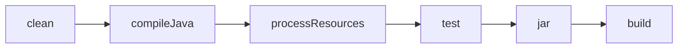

# 🛠️ Organizacja projektu Java z Gradle (Groovy DSL)

> Przewodnik po strukturze projektu, pliku `build.gradle` w Groovy DSL, systemie zależności i podstawowych komendach Gradle.

---

## 📁 Struktura projektu Gradle

Standardowy projekt Gradle w Javie wygląda następująco:

```bash
my-java-gradle-project/
├── src/
│   ├── main/
│   │   ├── java/            # Kod źródłowy aplikacji
│   │   └── resources/       # Zasoby aplikacji (np. pliki konfiguracyjne)
│   └── test/
│       ├── java/            # Testy jednostkowe
│       └── resources/       # Zasoby testowe
├── build.gradle             # Główny plik konfiguracyjny projektu (Groovy DSL)
├── settings.gradle          # Definicje projektu (np. nazwa rootProject)
├── gradlew / gradlew.bat    # Skrypty uruchomieniowe Gradle Wrapper
├── gradle/                  # Katalog z konfiguracją wrappera
├── build/                   # Folder wynikowy (odpowiednik target/ w Mavenie)
└── README.md                # Dokumentacja projektu
```

💡 **Gradle Wrapper** (`gradlew`) pozwala uruchamiać projekt bez konieczności instalowania Gradle w systemie — wystarczy wywołać `./gradlew build`.

---

## ⚙️ Plik `build.gradle` (Groovy DSL)

Gradle wykorzystuje język **Groovy DSL** do opisu konfiguracji projektu. Jest to najczęściej stosowany sposób konfiguracji, szczególnie w projektach Java i enterprise.

### 🧠 Dlaczego Groovy DSL?

* 🔹 Starszy i szeroko wspierany — większość istniejących projektów i pluginów korzysta z Groovy.
* 🔹 Składnia elastyczna i prosta do nauki.
* 🔹 Nie wymaga znajomości Kotlina.
* 🔹 Lepsza kompatybilność z przykładami i dokumentacją online.

> Kotlin DSL zyskuje popularność w nowych projektach, jednak **Groovy DSL** pozostaje najczęściej używanym językiem konfiguracji w świecie Gradle.

---

### 📘 Przykład pliku `build.gradle`

```groovy
plugins {
    id 'java'                 // Wtyczka Java
    id 'application'          // Umożliwia uruchamianie aplikacji
}

group = 'com.example'
version = '1.0.0'

sourceCompatibility = '17'

dependencies {
    implementation 'org.apache.commons:commons-lang3:3.12.0'
    testImplementation 'org.junit.jupiter:junit-jupiter:5.9.0'
}

repositories {
    mavenCentral()            // Repozytorium Maven Central
}

application {
    mainClass = 'com.example.Main'  // Punkt wejścia aplikacji
}
```

---

## 🌐 Jak działa Gradle — system zależności i repozytoria

Gradle zarządza zależnościami w sposób elastyczny, korzystając z repozytoriów Maven i własnego cache.

### 🏛️ Repozytoria

| Typ               | Przykład         | Opis                                                |
| ----------------- | ---------------- | --------------------------------------------------- |
| **Maven Central** | `mavenCentral()` | Domyślne repozytorium dla większości projektów      |
| **Google**        | `google()`       | Repozytorium używane głównie w Androidzie           |
| **lokalne**       | `mavenLocal()`   | Folder `~/.m2/repository` – współdzielony z Mavenem |

📂 **Lokalizacja cache Gradle:**

```
~/.gradle/caches/modules-2/files-2.1/
```

### 🔄 Proces rozwiązywania zależności

1. Gradle analizuje sekcję `dependencies`.
2. Sprawdza, czy biblioteka istnieje w lokalnym cache.
3. Jeśli nie – pobiera ją z repozytorium (np. Maven Central).
4. Zapisuje ją w cache, by kolejne kompilacje były szybsze.

---

## 🧰 Podstawowe komendy Gradle

| Komenda               | Opis                                                          |
| --------------------- | ------------------------------------------------------------- |
| `gradle tasks`        | Wyświetla listę dostępnych zadań                              |
| `gradle build`        | Kompiluje, testuje i buduje aplikację                         |
| `gradle clean`        | Usuwa katalog `build/`                                        |
| `gradle test`         | Uruchamia testy jednostkowe                                   |
| `gradle run`          | Uruchamia aplikację (jeśli zdefiniowano plugin `application`) |
| `gradle dependencies` | Wyświetla drzewo zależności                                   |

💡 Użycie wrappera:

```bash
./gradlew build
```

(w systemie Windows: `gradlew.bat build`)

---

## ⚙️ Popularne pluginy Gradle

| Plugin          | Opis                                          |
| --------------- | --------------------------------------------- |
| `java`          | Kompilacja projektów Java                     |
| `application`   | Uruchamianie aplikacji konsolowych            |
| `java-library`  | Tworzenie bibliotek Java                      |
| `maven-publish` | Publikowanie artefaktów do repozytoriów Maven |
| `checkstyle`    | Analiza jakości kodu                          |
| `jacoco`        | Raporty pokrycia testów                       |

---

## 🧠 Gradle Build Lifecycle

Gradle dzieli proces budowania na **taski (zadania)**, które można łączyć i rozszerzać.



Każde zadanie jest częścią grafu zależności – można tworzyć własne taski i ustawiać między nimi relacje.

---

## 🔍 Porównanie Maven vs Gradle

| Cecha              | Maven                  | Gradle                        |
| ------------------ | ---------------------- | ----------------------------- |
| Język konfiguracji | XML (`pom.xml`)        | Groovy DSL                    |
| Szybkość           | Wolniejszy (opisowy)   | Szybszy (inkrementalny build) |
| Elastyczność       | Sztywniejsza struktura | Skryptowy, dynamiczny         |
| Pluginy            | Statyczne              | Dynamiczne, rozszerzalne      |
| Cache kompilacji   | Brak wbudowanego       | Tak, automatyczny             |

---

## 📚 Dodatkowe zasoby

* [Oficjalna dokumentacja Gradle](https://docs.gradle.org/)
* [Gradle Plugin Portal](https://plugins.gradle.org/)
* [Porównanie Maven vs Gradle – Baeldung](https://www.baeldung.com/gradle-vs-maven)

---
