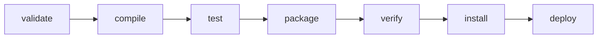

# ☕ Organizacja projektu Java z Maven

> Kompleksowy przewodnik po strukturze projektu, pliku `pom.xml`, działaniu Mavena oraz podstawowych komendach `mvn`

---

## 📁 Struktura projektu Maven

Standardowa struktura projektu Maven wygląda następująco:

```bash
my-java-project/
├── src/
│   ├── main/
│   │   ├── java/            # Kod źródłowy aplikacji
│   │   └── resources/       # Pliki konfiguracyjne (np. application.properties)
│   └── test/
│       ├── java/            # Testy jednostkowe
│       └── resources/       # Zasoby testowe
├── target/                  # Folder zbudowanych plików (np. .class, .jar)
├── pom.xml                  # Główny plik konfiguracyjny projektu
└── README.md                # Dokumentacja projektu
```

📘 **Uwaga:** Struktura ta jest rozpoznawana automatycznie przez Mavena i nie wymaga dodatkowej konfiguracji.

---

## ⚙️ Plik `pom.xml`

Plik `pom.xml` (Project Object Model) jest sercem projektu Maven. Zawiera informacje o projekcie, zależnościach, wtyczkach i konfiguracji kompilacji.

### 🧩 Podstawowy szkielet `pom.xml`

```xml
<project xmlns="http://maven.apache.org/POM/4.0.0"
         xmlns:xsi="http://www.w3.org/2001/XMLSchema-instance"
         xsi:schemaLocation="http://maven.apache.org/POM/4.0.0
                             http://maven.apache.org/xsd/maven-4.0.0.xsd">
    <modelVersion>4.0.0</modelVersion>

    <groupId>com.example</groupId>        <!-- unikalny identyfikator organizacji -->
    <artifactId>my-java-project</artifactId> <!-- nazwa artefaktu -->
    <version>1.0.0</version>               <!-- wersja projektu -->
    <packaging>jar</packaging>             <!-- typ artefaktu (jar, war, pom) -->

    <name>My Java Project</name>
    <description>Przykładowy projekt Java zarządzany przez Maven</description>

    <dependencies>
        <!-- ✅ Przykład zależności -->
        <dependency>
            <groupId>org.junit.jupiter</groupId>
            <artifactId>junit-jupiter-api</artifactId>
            <version>5.9.0</version>
            <scope>test</scope>
        </dependency>
    </dependencies>

    <build>
        <plugins>
            <!-- ⚙️ Kompilator Java -->
            <plugin>
                <groupId>org.apache.maven.plugins</groupId>
                <artifactId>maven-compiler-plugin</artifactId>
                <version>3.8.1</version>
                <configuration>
                    <source>17</source>
                    <target>17</target>
                </configuration>
            </plugin>
        </plugins>
    </build>
</project>
```

### 🔍 Kluczowe sekcje:

| Sekcja           | Opis                                                      |
| ---------------- | --------------------------------------------------------- |
| `<groupId>`      | Unikalny identyfikator projektu (np. domena odwrócona)    |
| `<artifactId>`   | Nazwa modułu / biblioteki                                 |
| `<version>`      | Wersja projektu                                           |
| `<dependencies>` | Lista bibliotek wymaganych do kompilacji lub uruchomienia |
| `<build>`        | Konfiguracja procesu budowania, pluginy, kompilator itp.  |

---

## 🌐 Jak działa Maven — repozytoria i zależności

Maven automatycznie **pobiera zależności** (biblioteki, pluginy itp.) z repozytoriów i przechowuje je lokalnie, aby nie trzeba było ich pobierać ponownie.

### 🏛️ Źródła pobierania

| Typ repozytorium              | Domyślna lokalizacja                                                         | Opis                                                    |
| ----------------------------- | ---------------------------------------------------------------------------- | ------------------------------------------------------- |
| **Centralne (Maven Central)** | [https://repo.maven.apache.org/maven2](https://repo.maven.apache.org/maven2) | Domyślne repozytorium Maven z tysiącami bibliotek       |
| **Zdalne (Remote)**           | Określone w `pom.xml` lub `settings.xml`                                     | Można dodać własne repozytoria np. firmowe lub prywatne |
| **Lokalne (Local)**           | `~/.m2/repository`                                                           | Bufor na pobrane paczki na dysku lokalnym               |

📂 **Przykład ścieżki lokalnego repozytorium:**

```
C:\Users\Jan\.m2\repository\org\springframework\spring-core\5.3.10\spring-core-5.3.10.jar
```

### 🔄 Proces pobierania zależności

1. Maven analizuje sekcję `<dependencies>` w pliku `pom.xml`.
2. Sprawdza, czy biblioteka istnieje w **lokalnym repozytorium** (`~/.m2/repository`).
3. Jeśli nie – pobiera ją z **Maven Central** (lub innego zdalnego repozytorium).
4. Zachowuje ją lokalnie do ponownego wykorzystania.

💡 **Zaletą tego podejścia** jest brak potrzeby dołączania bibliotek do repozytorium kodu (np. Git).

---

## 🧰 Najważniejsze komendy Maven

| Komenda               | Opis                                                   |
| --------------------- | ------------------------------------------------------ |
| `mvn clean`           | Usuwa katalog `target/` z poprzednich kompilacji       |
| `mvn compile`         | Kompiluje kod źródłowy projektu                        |
| `mvn test`            | Uruchamia testy jednostkowe                            |
| `mvn package`         | Tworzy paczkę `.jar` lub `.war` w folderze `target/`   |
| `mvn install`         | Instaluje paczkę w lokalnym repozytorium Maven (~/.m2) |
| `mvn site`            | Generuje dokumentację projektu                         |
| `mvn dependency:tree` | Wyświetla drzewo zależności projektu                   |

💡 **Pro tip:** Możesz łączyć komendy, np.:

```bash
mvn clean package
```

co oznacza *„wyczyść projekt i następnie zbuduj paczkę”*.

---

## 🧩 Najczęściej używane pluginy Maven

| Plugin                    | Opis                                             |
| ------------------------- | ------------------------------------------------ |
| `maven-compiler-plugin`   | Kompiluje kod źródłowy Java                      |
| `maven-surefire-plugin`   | Uruchamia testy jednostkowe (JUnit, TestNG)      |
| `maven-jar-plugin`        | Tworzy pliki JAR                                 |
| `maven-war-plugin`        | Buduje aplikacje webowe (WAR)                    |
| `maven-dependency-plugin` | Zarządza zależnościami, np. kopiowanie bibliotek |
| `maven-site-plugin`       | Generuje stronę z dokumentacją projektu          |

🔧 Pluginy można rozszerzać, konfigurować lub tworzyć własne — są one kluczowym elementem elastyczności Mavena.

---

## 🧠 Maven Lifecycle (Cykl życia projektu)

Maven składa się z trzech głównych cykli życia:

1. **default** – proces kompilacji, testowania i budowania artefaktu
2. **clean** – czyszczenie projektu
3. **site** – generowanie dokumentacji



---

## 📚 Dodatkowe zasoby

* [Oficjalna dokumentacja Maven](https://maven.apache.org/guides/index.html)
* [Repozytorium Maven Central](https://search.maven.org/)
* [Pluginy Maven](https://maven.apache.org/plugins/)

---
